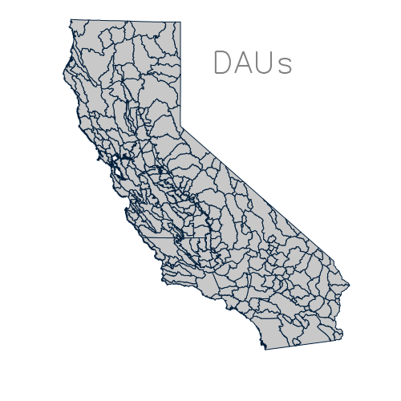
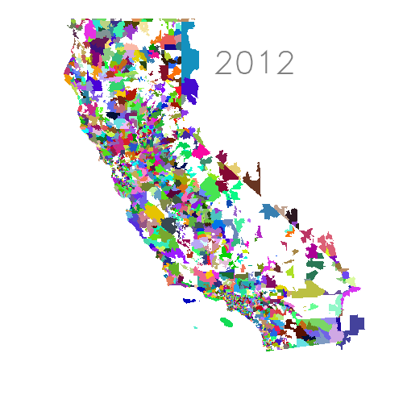

* Symsoft Testing

I provided comparison testing of the symsoft data from 2024 to that from the
historical DWR production system, as well as newly generated data locally.
Symsoft rewrote the entire CIMIS processing corpus in python.  Equally
important, they incorporated a new radiation processing method using data
downloaded from cloud archives rather than directly accessed from the DWR dish.

I've made the following observations:

** Constant Maps (GOOD)

Symsoft's constant maps, eg. Z, gamma, linke all look proper

** Radiation Maps (GOOD)

Symsoft's new net radiation methodology matches my locally generated
calculations, with some very small differences due to slight difference in Linke
Turbidity estimations.

The cloud based method itself works well with the archive providing all
requested images for most days, and the bulk of images for the rest of the days.

** Spatial Interpolations (Questionable, ERR?)

It was more difficult to test the spatially interpolated variables for *any*
day, as the historic DWR production station data always differed from the
station data used by symsoft.  This seemed to be a combination of new data being
added to the DWR record, as well as some stations that provided data not being
included in calculations.  In particular; stations 12,62,68,148, 175, 219 were
systematically not included in the calculations.  Note that nearly *every day*
saw changes in some of the other stations, that is new station data being added
to CIMIS after the original production calculations.

I can't make a more deterministic estimation, since I don't know what the new
*Symsoft* method for retrieving is.  I used the existing API at et.water.ca.go,
but the CIMIS.3 version must be different from this.

The underlying calculations for the interpolated data does seem okay, and the
differences more due to the station data lists.  ~U2~ is actually closer to the
expected values that I would have expected based on station differences.

** Derived Maps (ERR)

*** ea  (ERR,Old Method Used)
Over the course of the CIMIS processing, two alternative methods for
calculating $ea$, actual vapor pressure, have been used.  Sometime around
2018, DWR switched to a method using only ~Tdew~, dew point.  Symsoft used the
old method which combined ~ea~ estimations from both ~Tdew~ and ~RHx~,
relative humidity.  The differences are small, but we should probably not switch
back.  I think you should consider removing the RHx code entirely.

*** Rnl, ETo (Seem OK)
The formulation of these seem correct, but differ due to the interpolation
issues, and the ~ea~ difference.

* Testing methodology

These tests compare symsoft data for 2024, as provided via a set of exported
images, labeled below as *symsoft* or *s*, including all the parameters going
into the ETo calculation.  We compared these data to the DWR CIMIS.2 production
data, labeled below as *dish*, or *d*, because it's based on radiation from a
physical dish at DWR.  The actual data for the *dish* set was actually pulled
from the UC Davis repository.  There can be some differences between the two, if
their dish reception was different, but in general this is a copy of the DWR
data.  We did this for two reasons; 1) We had access the actual machine, so we
could easily sync the data over and 2) The public raster downloads available for
DWR's data are not accurately projected, and cannot be used.  Finally, a third
set of data *q* was created specifically for this testing.  These data were
independant calculations of the radiation parameters.  This is required, because
identifing differences between elevation parameters between *s* and *d* is not
enough to determine if the *s* data is actually accurate.

Using the above datasets, difference rasters were created for each variable.
These can be used to visualize where differences exist between the datasets.  In
addition, we further summarized the data by aggregating each variable, and the
differences between the datasets, based on DAU regions. DAU regions are good
because they are compact and based on underlying topographical data.  Many of
the tables below show summaries based on these regions.

** Constants

There are a few constant raster datasets that are used in calculations;
elevation (~Z~), the CA State boundary (~state~), and the psychrometric_constant
(~gamma~) are all the same between the three methods.

*** Zipcodes

The zipcode raster is used to aggregate the raster layers over areas for
summarization, and honestly to provide a more convenient interface for API
calls. Zipcodes are complicated by the fact that they are *not* a coverage for
the State.  Large portions of the state are not covered by any zipcode.  In most
cases this is probably okay, but it is strange.  CIMIS.2 uses a zipcode coverage
from the 2012 census.  Symsoft say they were told to use the 2012 version.
Zipcodes have changed so much however, I'd suggest that's not the right choice,
there seems to be no reason to try and maintain consistancy accross time with a
dataset that itself changes over time.

| Zipcodes 2012                 | Zipcodes 2019                 |
|-------------------------------+-------------------------------|
|  |  |
|-------------------------------+-------------------------------|

** Radiation Parameters

Rso, Rs, and K are the three parameters that are derived from the GOES satellite
data.  Symsoft's radiation methodology uses data pulled from public cloud
archives, where the CIMIS.2 uses data directly retreived from a dish.  There is
a difference in the calculations between *symsoft* and *quinn* in that *symsoft*
uses the Amazon s3 cloud storage, where by default *quinn* used google's gl:
archive. We have noted that were days (2024-09-27:2024-09-29) that the google
archive was missing significant goes Band 2 [B2] images. The *quinn* archive
back-filled those dates from the *s3* archive.

*** versus 2024 dish measurements

Because of various problems with the dish, there can be differences in these to
methods, these differences can be quite large.  The table below shows the number
of days where a particular DAU is more than 10% different between the *dish* and
*symsoft*. Most/All of these are because of dish issues.

#+CALL: figures/README.org:delta_dish_10()
#+RESULTS:
|       date | count |
|------------+-------|
| 2024-01-15 |   278 |
| 2024-03-01 |   167 |
| 2024-03-02 |    15 |
| 2024-03-03 |    30 |
| 2024-03-06 |    83 |
| 2024-03-07 |    71 |
| 2024-03-14 |    18 |
| 2024-05-08 |   278 |
| 2024-05-23 |   278 |
| 2024-07-21 |   278 |
| 2024-08-27 |    11 |
| 2024-09-15 |   278 |
| 2024-09-26 |    16 |
| 2024-10-04 |   278 |
| 2024-10-19 |    21 |
| 2024-10-22 |    13 |
| 2024-12-05 |   278 |

*** versus *quinn* estimations

It's much more important to compare the *symsoft* parameters with the *quinn*
dataset.  This verifies the calculations of the radiation parameters.  Here, the
results are considerably better with almost no major differences. The table
below shows dates that have multiple DAU regions with only a *1%* difference
between the two methods.

Somewhat surprisingly, these are due to different estimations of ~Rso~, not
different ~K~ estimations.  Note, that these dates mostly lay on the 11th, and
18th days.  These differences are the a by product of the linke turbidity
differences. The current method has estimates for linke turbidity about every
week.  And our method just chooses the closest matching date for the turbidity.
These small differences are because the symsoft and quinn methods use different
values when the date falls exactly between the estimates for the 7th,15th and
21st turbidities.

Number of DAU's with a >1% difference in Rs for the year

#+CALL: figures/README.org:delta_web_1()
#+RESULTS:
|       date | daus | b2_cnt |
|------------+------+--------|
| 2024-01-11 |   16 |     33 |
| 2024-02-18 |   11 |     37 |
| 2024-03-11 |    4 |     39 |
| 2024-03-18 |   26 |     40 |
| 2024-04-11 |   19 |     42 |
| 2024-09-18 |   10 |     40 |
| 2024-09-28 |    2 |     40 |
| 2024-10-11 |    2 |     37 |
| 2024-10-18 |   69 |     37 |
| 2024-11-11 |   86 |     35 |
| 2024-11-18 |   20 |     34 |
| 2024-12-11 |   23 |     33 |
| 2024-12-18 |   24 |     33 |

Number of DAU's with a >1% difference in ~K~! for the year
#+CALL: figures/README.org:delta_web_K_1()

#+RESULTS:
|       date | daus | b2_cnt |
|------------+------+--------|
| 2024-09-28 |    2 |     40 |

** Interpolated Parameters

There are many larger differences in the calculations of the spatially
interpolated values for some of these parameters.  This is primarily due to
differences in the underlying station data used in the calculations, usually
because station data has been added to the record, but also because some
stations were not included in the symsoft calculations; In particular; stations
12,62,68,148, 175, 219 were systematically not included in the calculations.
Note that nearly *every day* saw changes in some of the other stations, that is
new station data being added to CIMIS after the original production calculations.

Using the DAU aggregated data, I combined all area weighted differences for
every day, to get the average daily difference.  I then looked at the dates where
these outliers occured.  I then looked at individual DAUs to investigate where
accross the state the largest differences occured, and how big those were.
These are important issues when considering whether the *Symsoft* data can
replace the DWR production data for 2024.

*** Tx - Maximum Temperature

Overall, there are a few days where the average statewide difference exists, but
the differences primarily occur in a few DAUs and over a few spans of time.
These indicate probable large differences in the reporting stations. for these
particular days.

**** Statewide differences

Overall there were only a few days with appreciable statewide differences.
These show the number of days where the average difference was dtx. There is no
bias in this data.

#+CALL: figures/README.org:catxd()

#+RESULTS:
|  dtx | count |
|------+-------|
| -0.8 |     1 |
| -0.6 |     2 |
| -0.5 |     4 |
| -0.4 |     4 |
| -0.3 |     5 |
| -0.2 |    15 |
| -0.1 |   109 |
|  0.0 |   196 |
|  0.1 |    26 |
|  0.7 |     1 |

Most of these differences occured in September.  The largest positive value
however on 2024-07-02.

#+CALL: figures/README.org:catxdate()

#+RESULTS:
|       date |   dtx |
|------------+-------|
| 2024-07-02 |  0.73 |
| 2024-07-05 | -0.47 |
| 2024-09-19 | -0.47 |
| 2024-09-20 | -0.44 |
| 2024-09-21 | -0.44 |
| 2024-09-22 | -0.58 |
| 2024-09-23 | -0.75 |
| 2024-09-24 | -0.34 |
| 2024-09-26 | -0.47 |
| 2024-09-27 | -0.49 |
| 2024-09-28 | -0.43 |
| 2024-09-29 | -0.58 |
| 2024-10-02 | -0.26 |
| 2024-11-30 | -0.29 |
| 2024-12-02 | -0.32 |
| 2024-12-30 | -0.36 |
| 2024-12-31 | -0.33 |

**** DAU based differences
Over indidivual DAUs however, there can be much larger differences within a
particular DAU.  Within DAU's differences on a day can be greater than 10
degress Celcius. This table shows the number of days where particular DAUs
differ either less than, or more than the DWR data.

#+CALL: figures/README.org:dautx()

#+RESULTS:
| dau | lt10 | gt10 |
|-----+------+------|
| 020 |   10 |      |
| 021 |    8 |      |
| 023 |    2 |      |
| 027 |   10 |      |
| 028 |    1 |      |
| 030 |    2 |      |
| 032 |   10 |      |
| 291 |      |    1 |
| 330 |      |    1 |
| 339 |      |    1 |

And these are the particular dates where those differences occured. In this, we
again have one anomolus date, ~2024-07-02~ and then differences throughout september.

#+CALL: figures/README.org:dautx_date()

#+RESULTS:
|       date | lt10 | gt10 |
|------------+------+------|
| 2024-07-02 |      |    3 |
| 2024-09-19 |    4 |      |
| 2024-09-20 |    3 |      |
| 2024-09-21 |    4 |      |
| 2024-09-22 |    6 |      |
| 2024-09-23 |    7 |      |
| 2024-09-24 |    4 |      |
| 2024-09-26 |    3 |      |
| 2024-09-27 |    4 |      |
| 2024-09-28 |    4 |      |
| 2024-09-29 |    4 |      |

*** Tn - Minimum

**** Statewide differences

Overall there were only a few days with appreciable statewide differences.
Again, we see no overall bias, and smaller average differences for the outliers.

#+CALL: figures/README.org:catnd()

#+RESULTS:
|  dtn | count |
|------+-------|
| -0.3 |     3 |
| -0.2 |     7 |
| -0.1 |   110 |
|  0.0 |   168 |
|  0.1 |    73 |
|  0.2 |     1 |
|  0.5 |     1 |

Most of these differences occured in September.  As with ~Tx~ largest positive value
however on 2024-07-02.

#+CALL: figures/README.org:catndate()

#+RESULTS:
|       date |   dtn |
|------------+-------|
| 2024-07-02 |  0.49 |
| 2024-09-21 | -0.29 |
| 2024-09-22 | -0.27 |
| 2024-09-23 | -0.31 |

**** DAU based differences
Not surprisingly, the outlier differences were smaller for ~Tn~.  The table
below shows the DAUs different by more or less than 6 degrees C.  The list is
similar to those from ~Tx~

#+CALL: figures/README.org:dautn()

#+RESULTS:
| dau | lt6 | gt6 |
|-----+-----+-----|
| 020 |   2 |     |
| 027 |   2 |     |
| 032 |   2 |     |
| 262 |     |   1 |
| 290 |     |   1 |
| 291 |     |   1 |
| 330 |     |   1 |
| 339 |     |   1 |
| 340 |     |   1 |

And these are the particular dates where those differences occured. In this, we
again have one anomolus date, ~2024-07-02~ and again differences in September,
although less dates.

#+CALL: figures/README.org:dautn_date()

#+RESULTS:
|       date | lt6 | gt6 |
|------------+-----+-----|
| 2024-07-02 |     |   5 |
| 2024-08-25 |     |   1 |
| 2024-09-22 |   3 |     |
| 2024-09-23 |   3 |     |

*** Tdew - Dew Point Temperature

~Tdew~ is quite strange. I don't understand why the variations in ~Tdew~ should
be greater than that of ~Tn~, but they certainly are.

**** Statewide differences

There are significantly more days that resulted in appreciable changes in

Overall there were only a few days with appreciable statewide differences.
These show the number of days where the average difference was dtdew. There is no
bias in this data.

#+CALL: figures/README.org:catdewd()

#+RESULTS:
| dtdew | count |
|-------+-------|
|  -0.1 |    11 |
|   0.0 |   192 |
|   0.1 |   110 |
|   0.2 |    15 |
|   0.3 |    20 |
|   0.4 |    14 |
|   0.5 |     1 |

Most of these differences occured in September.  The largest positive value
however on 2024-07-02.

#+CALL: figures/README.org:catdewdate()

#+RESULTS:
|       date | dtdew |
|------------+-------|
| 2024-01-23 |  0.29 |
| 2024-01-24 |  0.27 |
| 2024-01-25 |  0.26 |
| 2024-02-02 |  0.29 |
| 2024-02-10 |  0.39 |
| 2024-02-17 |  0.26 |
| 2024-02-18 |  0.31 |
| 2024-02-19 |  0.36 |
| 2024-02-20 |  0.32 |
| 2024-02-21 |  0.36 |
| 2024-02-22 |  0.35 |
| 2024-02-27 |  0.39 |
| 2024-03-03 |  0.35 |
| 2024-03-07 |  0.25 |
| 2024-03-12 |  0.42 |
| 2024-03-13 |  0.39 |
| 2024-03-14 |  0.34 |
| 2024-03-15 |  0.30 |
| 2024-03-17 |  0.32 |
| 2024-03-18 |  0.30 |
| 2024-03-21 |  0.28 |
| 2024-04-05 |  0.33 |
| 2024-04-06 |  0.39 |
| 2024-04-07 |  0.36 |
| 2024-04-08 |  0.37 |
| 2024-04-09 |  0.32 |
| 2024-04-10 |  0.33 |
| 2024-04-11 |  0.36 |
| 2024-04-12 |  0.39 |
| 2024-04-13 |  0.35 |
| 2024-04-14 |  0.32 |
| 2024-04-15 |  0.30 |
| 2024-04-16 |  0.38 |
| 2024-04-17 |  0.33 |
| 2024-12-30 |  0.55 |

**** DAU based differences
Over indidivual DAUs however, there can be much larger differences within a
particular DAU.  Within DAU's differences on a day can be greater than 10
degress Celcius. This table shows the number of days where particular DAUs
differ either less than, or more than the DWR data.

#+CALL: figures/README.org:dautdew()

#+RESULTS:
| dau | lt6 | gt6 |
|-----+-----+-----|
| 081 |     |   1 |
| 087 |     |   1 |
| 110 |     |  17 |
| 114 |     |   1 |
| 289 |     |   6 |
| 290 |     |  26 |
| 291 |     |  24 |
| 314 |   2 |     |
| 317 |     |   1 |
| 321 |   3 |     |
| 322 |   1 |     |
| 324 |   3 |     |
| 325 |   1 |     |
| 329 |     |   1 |
| 330 |     |  16 |
| 339 |     |  14 |
| 340 |     |  10 |
| 347 |     |   3 |

And these are the particular dates where those differences occured. In this, we
again have one anomolus date, ~2024-07-02~ and then differences throughout september.

#+CALL: figures/README.org:dautdew_date()

#+RESULTS:
|       date | lt10 | gt10 |
|------------+------+------|
| 2024-07-02 |      |    3 |
| 2024-09-19 |    4 |      |
| 2024-09-20 |    3 |      |
| 2024-09-21 |    4 |      |
| 2024-09-22 |    6 |      |
| 2024-09-23 |    7 |      |
| 2024-09-24 |    4 |      |
| 2024-09-26 |    3 |      |
| 2024-09-27 |    4 |      |
| 2024-09-28 |    4 |      |
| 2024-09-29 |    4 |      |

*** U2 - Wind speed at 6km

Wind speed is so close to the production values that it's almost strange
considering how many station differences there are in the interpolations.

**** Statewide differences

#+CALL: figures/README.org:cau2d()

#+RESULTS:
|  du2 | count |
|------+-------|
| -0.1 |     5 |
|  0.0 |   356 |
|  0.1 |     2 |

#+CALL: figures/README.org:cau2date()

#+RESULTS:
|       date |   du2 |
|------------+-------|
| 2024-01-07 | -0.06 |
| 2024-02-03 | -0.06 |
| 2024-03-03 | -0.05 |
| 2024-08-23 | -0.06 |
| 2024-08-24 | -0.06 |
| 2024-09-12 |  0.05 |
| 2024-12-30 |  0.09 |

**** DAU based differences

#+CALL: figures/README.org:dauu2()

#+RESULTS:
| dau | lt1 | gt1 |
|-----+-----+-----|
| 265 |     |   1 |
| 354 |   1 |     |
| 355 |   2 |     |

#+CALL: figures/README.org:dauu2_date()

#+RESULTS:
|       date | lt1 | gt1 |
|------------+-----+-----|
| 2024-03-29 |   2 |     |
| 2024-05-05 |   1 |     |
| 2024-12-30 |     |   1 |

** Derived Parameters

*** ea (ERROR)

Over the course of the CIMIS processing, two alternative methods for calculating
$ea$, actual vapor pressure, have been used.  Sometime around 2018, DWR
switched to a method using only ~Tdew~, dew point.  Symsoft used the old
method which combined ~ea~ estimations from both ~Tdew~ and ~RHx~, relative
humidity.  for CIMIS 2.0, DWR decided to only use ~Tdew~ in the ~es~
calculation.  It appears that symsoft misunderstood some production code in
their calculations.

As I don't have ~ea~ data from Symsoft, I can't make comparisons.  However,
indications below in ~Rnl~ suggest it could have not insignificant impact on
subsequent calculations.

*** Rnl - Long Wave Radiation

**** Statewide differences
The average values for California, ~Rnl~ are about -6.5.  Looking at the
difference, there is a small bias in the ~Rnl~ data.  The calculation looks
correct and these differences can be due both to differences in ~ea~, and the
production dish's (bad) ~Rs~ values.

#+CALL: figures/README.org:ca_var_d(v="dRnl")

#+RESULTS:
| drnl | count |
|------+-------|
| -1.4 |     1 |
| -0.7 |     2 |
| -0.6 |     3 |
| -0.5 |    11 |
| -0.4 |    33 |
| -0.3 |   107 |
| -0.2 |   113 |
| -0.1 |    74 |
|  0.0 |    13 |
|  0.3 |     1 |
|  0.4 |     1 |
|  0.9 |     1 |
|  6.0 |     1 |
|  7.3 |     1 |
|  8.3 |     1 |

We can see however, the some days, have very dramatic differences in the ~Rnl~
data.  Investigation shows these dates align with bad ~Rs~ estimates for the
production ~Rs~.

#+CALL: figures/README.org:ca_var_date(v="dRnl",x=10)

#+RESULTS:
|       date |  drnl |
|------------+-------|
| 2024-01-15 | -1.45 |
| 2024-03-14 |  8.26 |
| 2024-09-15 |  5.97 |
| 2024-10-28 |  7.34 |

*** ETo

Again, with the exception of ~ea~ the ETo calculation looks correct.

#+CALL: figures/README.org:ca_var_d(v="dETo")

#+RESULTS:
| deto | count |
|------+-------|
| -0.1 |     2 |
|  0.0 |   107 |
|  0.1 |   232 |
|  0.2 |    12 |
|  0.3 |     1 |
|  0.6 |     1 |
|  0.9 |     1 |
|  1.3 |     1 |
|  1.5 |     1 |
|  1.9 |     2 |
|  2.0 |     1 |
|  2.4 |     1 |
|  3.0 |     1 |
