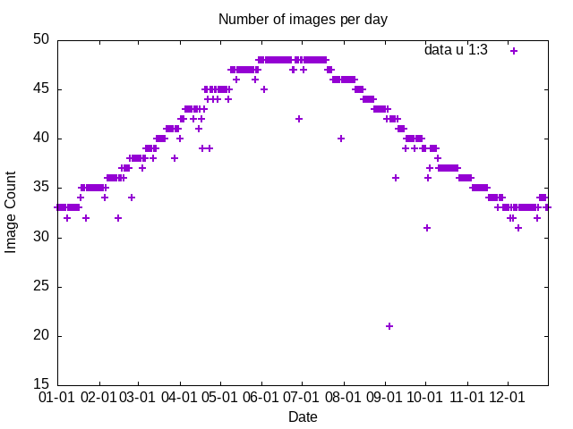

* Figures
#+PROPERTY: header-args:sql :engine postgresql :cmdline "service=symsoft" :tangle yes

This file includes notes on generating the figures used in the report, and
additional testing information, that lead to our selections.

** Inspection

We have a lot of data that needs investigation.  The very first thing we can do
is just look at the days and DAU's that have the largest variations, in
ETo. We can look at Symsoft over estimations (+ diff) and under estimations.

On the over estimation side, you see that these are

#+begin_src sql
    select date,doy,dau_code,ETo_average,deto_average
    from stats_d
  --  where date not in ('2024-05-08','2024-05-23','2024-03-14')
--  where dau_code in ('347')
    order by deto_average
    limit 25
#+end_src

#+RESULTS:
|       date | doy | dau_code |      eto_average |      deto_average |
|------------+-----+----------+------------------+-------------------|
| 2024-09-23 | 267 |      020 | 5.42345048928285 |  -2.3845556808547 |
| 2024-09-23 | 267 |      027 | 5.40120358518182 | -2.28959177408944 |
| 2024-09-23 | 267 |      032 | 5.24751353693237 | -2.27596363533326 |
| 2024-09-29 | 273 |      020 |  4.4881364604574 | -2.27212345947381 |
| 2024-09-29 | 273 |      027 | 4.55148703501875 | -2.25541485461568 |
| 2024-05-18 | 139 |      347 | 11.1265022161969 | -2.12335348225718 |
| 2024-09-29 | 273 |      032 | 4.25196829947871 | -2.07182143137478 |
| 2024-06-01 | 153 |      347 | 9.71912067731518 |   -2.000189801209 |
| 2024-05-17 | 138 |      347 | 9.43390611877439 | -1.97568660569204 |
| 2024-07-07 | 189 |      347 | 11.1752112288693 | -1.95152937955358 |
| 2024-09-21 | 265 |      020 | 4.67375932806368 | -1.94603213321026 |
| 2024-05-20 | 141 |      347 | 10.8448270011234 | -1.93088542537768 |
| 2024-09-21 | 265 |      027 |  4.6795647865096 | -1.92511901791671 |
| 2024-09-22 | 266 |      027 | 4.42651607599246 |  -1.9082771731162 |
| 2024-09-22 | 266 |      020 |  4.3597554679791 | -1.89185046078835 |
| 2024-09-20 | 264 |      020 |  4.4346386962906 | -1.86789280495852 |
| 2024-09-20 | 264 |      027 | 4.50163141936457 | -1.86070806268686 |
| 2024-09-29 | 273 |      021 | 4.38691953439382 | -1.82398812920844 |
| 2024-09-23 | 267 |      021 | 5.31027575474549 | -1.79158702878389 |
| 2024-09-21 | 265 |      032 | 4.46204380701715 | -1.76868181849203 |
| 2024-09-29 | 273 |      023 | 4.57187613475597 | -1.75174557576244 |
| 2024-06-15 | 167 |      347 |  10.316324612656 | -1.72966550321246 |
| 2024-07-05 | 187 |      342 | 10.0742867283952 | -1.72292934949971 |
| 2024-09-22 | 266 |      032 | 4.15316526471939 | -1.71115582349648 |
| 2024-09-27 | 271 |      020 | 4.30203081311256 | -1.70519185385529 |

When you look the highest diffs (order desc), you can see this is mostly because
of of a few days, which you can remove a few of these days ~where date not in
('2024-05-08','2024-05-23','2024-03-14')~

#+RESULTS: foo
|       date | doy | dau_code |           eto_average | eto_d_diff_average |
|------------+-----+----------+-----------------------+--------------------|
| 2024-02-06 |  37 |      325 |   -0.0981781527038937 |   1.28375159524598 |
| 2024-02-06 |  37 |      327 |    0.0551757940272871 |   1.21424295014019 |
| 2024-02-06 |  37 |      322 |    -0.133033331060946 |   1.20119731847334 |
| 2024-02-04 |  35 |          |    -0.434662733317306 |   1.16691191608282 |
| 2024-02-06 |  37 |      321 |   -0.0475207739925781 |   1.12728073356975 |
| 2024-02-05 |  36 |          |     -0.27932596234225 |   1.11548325301671 |
| 2024-02-06 |  37 |      323 | -9.89068171372549e-05 |   1.09412500013597 |
| 2024-01-15 |  15 |      087 |     0.259204099061073 |   1.08160410184847 |
| 2024-01-15 |  15 |      089 |     0.283684467798928 |   1.07637058170474 |
| 2024-01-15 |  15 |          |   -0.0647805325594737 |   1.07189462250796 |
| 2024-01-15 |  15 |      355 |     0.825888481072076 |   1.06395528344036 |
| 2024-02-06 |  37 |      324 |     0.150055082781237 |     1.046409590091 |
| 2024-01-15 |  15 |      354 |     0.880731028443277 |   1.04517404271495 |
| 2024-01-15 |  15 |      357 |     0.901373268192827 |   1.02953231242681 |
| 2024-02-06 |  37 |      320 |   -0.0274778117447752 |   1.01196058388436 |
| 2024-01-15 |  15 |      090 |     0.466975501759183 |   1.01151678901675 |
| 2024-01-15 |  15 |      353 |     0.865084678851801 |   1.00670114037613 |
| 2024-01-15 |  15 |      096 |     0.432676740976162 |   1.00432444491589 |
| 2024-01-15 |  15 |      075 |     0.267057258307891 |  0.978092016565099 |
| 2024-01-15 |  15 |      092 |     0.488019376683287 |  0.969466776386812 |
| 2024-01-15 |  15 |      073 |     0.318460117574073 |  0.969031240828252 |
| 2024-01-15 |  15 |      081 |      0.46375548512943 |  0.957346838860638 |
| 2024-01-15 |  15 |      074 |     0.334821877973377 |  0.954842223890084 |
| 2024-01-15 |  15 |      347 |     0.999264252667277 |   0.94791479793173 |
| 2024-01-15 |  15 |      356 |     0.893867511572148 |  0.947232128867881 |

However, if you look at the largest negative values, these all clustered around
a particular dau_code.  If you look, dau_code 347, Yuma, is the south-eastern
most DAU.

#+tblname: neg_diff
#+RESULTS:
|       date | dau_code |      eto_average | eto_d_diff_average |
|------------+----------+------------------+--------------------|
| 2024-05-18 |      347 | 11.1265022161969 |  -2.12335348225718 |
| 2024-06-01 |      347 | 9.71912067731518 |    -2.000189801209 |
| 2024-05-17 |      347 | 9.43390611877439 |  -1.97568660569204 |
| 2024-05-20 |      347 | 10.8448270011234 |  -1.93088542537768 |
| 2024-06-15 |      347 |  10.316324612656 |  -1.72966550321246 |
| 2024-06-16 |      347 | 10.6777551661846 |  -1.65373835072055 |
| 2024-04-24 |      347 | 8.00703923683512 |  -1.60031169197913 |
| 2024-05-19 |      347 | 10.7619095630977 |  -1.59832465192713 |
| 2024-05-18 |      356 | 11.0981782274568 |  -1.59255529883607 |
| 2024-06-13 |      347 | 9.13123784343252 |  -1.56340022653679 |
| 2024-05-04 |      347 |  8.4089072222943 |  -1.53200683681235 |
| 2024-03-29 |      347 | 7.31628669414388 |  -1.50962690771064 |
| 2024-06-08 |      347 | 9.86141196997489 |   -1.5047525443072 |
| 2024-06-28 |      347 | 9.99482607231125 |  -1.48313254979105 |
| 2024-05-17 |      356 | 9.36152579361089 |  -1.46279225772974 |
| 2024-06-01 |      356 | 9.53839007019037 |  -1.45310709585171 |
| 2024-05-20 |      356 | 10.8758954739992 |  -1.44871444983957 |
| 2024-04-18 |      347 | 6.84928727245782 |  -1.44781496503824 |
| 2024-06-05 |      347 | 9.19333419498974 |  -1.44622334423141 |
| 2024-06-03 |      347 | 8.50746369294141 |  -1.44189453606932 |
| 2024-06-07 |      347 | 9.69280431177519 |   -1.4241775936938 |
| 2024-04-23 |      347 | 7.15990186018348 |  -1.37021338338646 |
| 2024-03-03 |      347 | 5.60399297398049 |  -1.35063251186047 |
| 2024-05-16 |      347 | 7.85381471528536 |   -1.3395328501297 |
| 2024-04-13 |      347 | 6.98385990333863 |  -1.33624520875795 |

* Constants

** DAUs

This shows the DAUs
#+begin_src bash :results raw
    grass --text ~/dwr-spatial-cimis/gdb/cimis/PERMANENT
  #  d.mon start=wx1
    d.mon start=cairo width=500 height=500 output=daus.png --overwrite
    d.vect map=dau display=shape fill_color=200:200:200
    # v.label map=dau fontsize=12 where='hectares>2000' column=dau_code labels=dau_labels
    #d.labels labels=dau_labels
    d.text text="DAUs" at=65,85 size=8 align=cc
  #  d.mon stop=wx1
    d.mon stop=cairo
    echo "[[file:daus.png]]"
#+end_src

#+RESULTS:
[[file:daus.png]]

#+name: zipcodes2012
#+begin_src bash :results raw
    grass --text ~/dwr-spatial-cimis/gdb/cimis/PERMANENT
  #  d.mon start=wx1
    d.mon start=cairo width=500 height=500 output=zipcodes2012.png --overwrite
    r.colors map=zipcode_2012@zipcode_2012 color=random
    d.rast zipcode_2012@zipcode_2012
    d.text text="2012" at=65,85 size=8 align=cc
    d.mon stop=cairo
    echo "[[file:zipcodes2012.png]]"
#+end_src

#+RESULTS: zipcodes2012
[[file:zipcodes2012.png]]
#+name: zipcodes2019
#+begin_src bash :results raw
    grass --text ~/dwr-spatial-cimis/gdb/cimis/PERMANENT
  #  d.mon start=wx1
    d.mon start=cairo width=500 height=500 output=zipcodes2019.png --overwrite
    r.colors map=zipcode@500m color=random
    d.rast zipcode@500m
    d.text text="2019" at=65,85 size=8 align=cc
    d.mon stop=cairo
    echo "[[file:zipcodes2019.png]]"
#+end_src

#+RESULTS: zipcodes2019
[[file:zipcodes2019.png]]

** Radiation

Here are some graphs specific for the radiation parameters.

*** Big differences between dish tah

#+name: delta_dish_10
#+begin_src sql
  select date,count(*) from stats_d
  where abs(dRs_average/Rs_average) > 0.10 group by date having count(*) > 10
#+end_src

#+RESULTS: delta_dish_10
|       date | count |
|------------+-------|
| 2024-01-15 |   278 |
| 2024-03-01 |   167 |
| 2024-03-02 |    15 |
| 2024-03-03 |    30 |
| 2024-03-06 |    83 |
| 2024-03-07 |    71 |
| 2024-03-14 |    18 |
| 2024-05-08 |   278 |
| 2024-05-23 |   278 |
| 2024-07-21 |   278 |
| 2024-08-27 |    11 |
| 2024-09-15 |   278 |
| 2024-09-26 |    16 |
| 2024-10-04 |   278 |
| 2024-10-19 |    21 |
| 2024-10-22 |    13 |
| 2024-12-05 |   278 |

#+end_src

*** How many images per day?

#+tblname: b2perday
#+begin_src sql
  select date,doy,cnt from b2 order by date;
#+end_src

#+RESULTS: b2perday
|       date | doy | cnt |
|------------+-----+-----|
| 2024-01-01 |   1 |  33 |
| 2024-01-02 |   2 |  33 |
| 2024-01-03 |   3 |  33 |
| 2024-01-04 |   4 |  33 |
| 2024-01-05 |   5 |  33 |
| 2024-01-06 |   6 |  33 |
| 2024-01-07 |   7 |  33 |
| 2024-01-08 |   8 |  32 |
| 2024-01-09 |   9 |  33 |
| 2024-01-10 |  10 |  33 |
| 2024-01-11 |  11 |  33 |
| 2024-01-12 |  12 |  33 |
| 2024-01-13 |  13 |  33 |
| 2024-01-14 |  14 |  33 |
| 2024-01-15 |  15 |  33 |
| 2024-01-16 |  16 |  33 |
| 2024-01-17 |  17 |  33 |
| 2024-01-18 |  18 |  34 |
| 2024-01-19 |  19 |  35 |
| 2024-01-20 |  20 |  35 |
| 2024-01-21 |  21 |  35 |
| 2024-01-22 |  22 |  32 |
| 2024-01-23 |  23 |  35 |
| 2024-01-24 |  24 |  35 |
| 2024-01-25 |  25 |  35 |
| 2024-01-26 |  26 |  35 |
| 2024-01-27 |  27 |  35 |
| 2024-01-28 |  28 |  35 |
| 2024-01-29 |  29 |  35 |
| 2024-01-30 |  30 |  35 |
| 2024-01-31 |  31 |  35 |
| 2024-02-01 |  32 |  35 |
| 2024-02-02 |  33 |  35 |
| 2024-02-03 |  34 |  35 |
| 2024-02-04 |  35 |  35 |
| 2024-02-05 |  36 |  34 |
| 2024-02-06 |  37 |  35 |
| 2024-02-07 |  38 |  36 |
| 2024-02-08 |  39 |  36 |
| 2024-02-09 |  40 |  36 |
| 2024-02-10 |  41 |  36 |
| 2024-02-11 |  42 |  36 |
| 2024-02-12 |  43 |  36 |
| 2024-02-13 |  44 |  36 |
| 2024-02-14 |  45 |  36 |
| 2024-02-15 |  46 |  32 |
| 2024-02-16 |  47 |  36 |
| 2024-02-17 |  48 |  36 |
| 2024-02-18 |  49 |  37 |
| 2024-02-19 |  50 |  36 |
| 2024-02-20 |  51 |  37 |
| 2024-02-21 |  52 |  37 |
| 2024-02-22 |  53 |  37 |
| 2024-02-23 |  54 |  37 |
| 2024-02-24 |  55 |  38 |
| 2024-02-25 |  56 |  34 |
| 2024-02-26 |  57 |  38 |
| 2024-02-27 |  58 |  38 |
| 2024-02-28 |  59 |  38 |
| 2024-02-29 |  60 |  38 |
| 2024-03-01 |  61 |  38 |
| 2024-03-02 |  62 |  38 |
| 2024-03-03 |  63 |  38 |
| 2024-03-04 |  64 |  37 |
| 2024-03-05 |  65 |  38 |
| 2024-03-06 |  66 |  38 |
| 2024-03-07 |  67 |  39 |
| 2024-03-08 |  68 |  39 |
| 2024-03-09 |  69 |  39 |
| 2024-03-10 |  70 |  39 |
| 2024-03-11 |  71 |  39 |
| 2024-03-12 |  72 |  38 |
| 2024-03-13 |  73 |  39 |
| 2024-03-14 |  74 |  39 |
| 2024-03-15 |  75 |  40 |
| 2024-03-16 |  76 |  40 |
| 2024-03-17 |  77 |  40 |
| 2024-03-18 |  78 |  40 |
| 2024-03-19 |  79 |  40 |
| 2024-03-20 |  80 |  40 |
| 2024-03-21 |  81 |  40 |
| 2024-03-22 |  82 |  41 |
| 2024-03-23 |  83 |  41 |
| 2024-03-24 |  84 |  41 |
| 2024-03-25 |  85 |  41 |
| 2024-03-26 |  86 |  41 |
| 2024-03-27 |  87 |  41 |
| 2024-03-28 |  88 |  38 |
| 2024-03-29 |  89 |  41 |
| 2024-03-30 |  90 |  41 |
| 2024-03-31 |  91 |  41 |
| 2024-04-01 |  92 |  40 |
| 2024-04-02 |  93 |  42 |
| 2024-04-03 |  94 |  42 |
| 2024-04-04 |  95 |  42 |
| 2024-04-05 |  96 |  43 |
| 2024-04-06 |  97 |  43 |
| 2024-04-07 |  98 |  43 |
| 2024-04-08 |  99 |  43 |
| 2024-04-09 | 100 |  43 |
| 2024-04-10 | 101 |  43 |
| 2024-04-11 | 102 |  42 |
| 2024-04-12 | 103 |  43 |
| 2024-04-13 | 104 |  43 |
| 2024-04-14 | 105 |  43 |
| 2024-04-15 | 106 |  41 |
| 2024-04-16 | 107 |  43 |
| 2024-04-17 | 108 |  42 |
| 2024-04-18 | 109 |  39 |
| 2024-04-19 | 110 |  43 |
| 2024-04-20 | 111 |  45 |
| 2024-04-21 | 112 |  45 |
| 2024-04-22 | 113 |  44 |
| 2024-04-23 | 114 |  39 |
| 2024-04-24 | 115 |  45 |
| 2024-04-25 | 116 |  45 |
| 2024-04-26 | 117 |  44 |
| 2024-04-27 | 118 |  45 |
| 2024-04-28 | 119 |  45 |
| 2024-04-29 | 120 |  44 |
| 2024-04-30 | 121 |  45 |
| 2024-05-01 | 122 |  45 |
| 2024-05-02 | 123 |  45 |
| 2024-05-03 | 124 |  45 |
| 2024-05-04 | 125 |  45 |
| 2024-05-05 | 126 |  45 |
| 2024-05-06 | 127 |  45 |
| 2024-05-07 | 128 |  44 |
| 2024-05-08 | 129 |  45 |
| 2024-05-09 | 130 |  47 |
| 2024-05-10 | 131 |  47 |
| 2024-05-11 | 132 |  47 |
| 2024-05-12 | 133 |  47 |
| 2024-05-13 | 134 |  46 |
| 2024-05-14 | 135 |  47 |
| 2024-05-15 | 136 |  47 |
| 2024-05-16 | 137 |  47 |
| 2024-05-17 | 138 |  47 |
| 2024-05-18 | 139 |  47 |
| 2024-05-19 | 140 |  47 |
| 2024-05-20 | 141 |  47 |
| 2024-05-21 | 142 |  47 |
| 2024-05-22 | 143 |  47 |
| 2024-05-23 | 144 |  47 |
| 2024-05-24 | 145 |  47 |
| 2024-05-25 | 146 |  47 |
| 2024-05-26 | 147 |  47 |
| 2024-05-27 | 148 |  46 |
| 2024-05-28 | 149 |  47 |
| 2024-05-29 | 150 |  47 |
| 2024-05-30 | 151 |  48 |
| 2024-05-31 | 152 |  48 |
| 2024-06-01 | 153 |  48 |
| 2024-06-02 | 154 |  48 |
| 2024-06-03 | 155 |  45 |
| 2024-06-04 | 156 |  48 |
| 2024-06-05 | 157 |  48 |
| 2024-06-06 | 158 |  48 |
| 2024-06-07 | 159 |  48 |
| 2024-06-08 | 160 |  48 |
| 2024-06-09 | 161 |  48 |
| 2024-06-10 | 162 |  48 |
| 2024-06-11 | 163 |  48 |
| 2024-06-12 | 164 |  48 |
| 2024-06-13 | 165 |  48 |
| 2024-06-14 | 166 |  48 |
| 2024-06-15 | 167 |  48 |
| 2024-06-16 | 168 |  48 |
| 2024-06-17 | 169 |  48 |
| 2024-06-18 | 170 |  48 |
| 2024-06-19 | 171 |  48 |
| 2024-06-20 | 172 |  48 |
| 2024-06-21 | 173 |  48 |
| 2024-06-22 | 174 |  48 |
| 2024-06-23 | 175 |  48 |
| 2024-06-24 | 176 |  47 |
| 2024-06-25 | 177 |  47 |
| 2024-06-26 | 178 |  48 |
| 2024-06-27 | 179 |  48 |
| 2024-06-28 | 180 |  48 |
| 2024-06-29 | 181 |  42 |
| 2024-06-30 | 182 |  48 |
| 2024-07-01 | 183 |  48 |
| 2024-07-02 | 184 |  47 |
| 2024-07-03 | 185 |  48 |
| 2024-07-04 | 186 |  48 |
| 2024-07-05 | 187 |  48 |
| 2024-07-06 | 188 |  48 |
| 2024-07-07 | 189 |  48 |
| 2024-07-08 | 190 |  48 |
| 2024-07-09 | 191 |  48 |
| 2024-07-10 | 192 |  48 |
| 2024-07-11 | 193 |  48 |
| 2024-07-12 | 194 |  48 |
| 2024-07-13 | 195 |  48 |
| 2024-07-14 | 196 |  48 |
| 2024-07-15 | 197 |  48 |
| 2024-07-16 | 198 |  48 |
| 2024-07-17 | 199 |  48 |
| 2024-07-18 | 200 |  48 |
| 2024-07-19 | 201 |  48 |
| 2024-07-20 | 202 |  47 |
| 2024-07-21 | 203 |  47 |
| 2024-07-22 | 204 |  47 |
| 2024-07-23 | 205 |  47 |
| 2024-07-24 | 206 |  46 |
| 2024-07-25 | 207 |  46 |
| 2024-07-26 | 208 |  46 |
| 2024-07-27 | 209 |  46 |
| 2024-07-28 | 210 |  46 |
| 2024-07-29 | 211 |  46 |
| 2024-07-30 | 212 |  40 |
| 2024-07-31 | 213 |  46 |
| 2024-08-01 | 214 |  46 |
| 2024-08-02 | 215 |  46 |
| 2024-08-03 | 216 |  46 |
| 2024-08-04 | 217 |  46 |
| 2024-08-05 | 218 |  46 |
| 2024-08-06 | 219 |  46 |
| 2024-08-07 | 220 |  46 |
| 2024-08-08 | 221 |  46 |
| 2024-08-09 | 222 |  46 |
| 2024-08-10 | 223 |  45 |
| 2024-08-11 | 224 |  45 |
| 2024-08-12 | 225 |  45 |
| 2024-08-13 | 226 |  45 |
| 2024-08-14 | 227 |  45 |
| 2024-08-15 | 228 |  45 |
| 2024-08-16 | 229 |  44 |
| 2024-08-17 | 230 |  44 |
| 2024-08-18 | 231 |  44 |
| 2024-08-19 | 232 |  44 |
| 2024-08-20 | 233 |  44 |
| 2024-08-21 | 234 |  44 |
| 2024-08-22 | 235 |  44 |
| 2024-08-23 | 236 |  44 |
| 2024-08-24 | 237 |  43 |
| 2024-08-25 | 238 |  43 |
| 2024-08-26 | 239 |  43 |
| 2024-08-27 | 240 |  43 |
| 2024-08-28 | 241 |  43 |
| 2024-08-29 | 242 |  43 |
| 2024-08-30 | 243 |  43 |
| 2024-08-31 | 244 |  43 |
| 2024-09-01 | 245 |  43 |
| 2024-09-02 | 246 |  42 |
| 2024-09-03 | 247 |  43 |
| 2024-09-04 | 248 |  21 |
| 2024-09-05 | 249 |  42 |
| 2024-09-06 | 250 |  42 |
| 2024-09-07 | 251 |  42 |
| 2024-09-08 | 252 |  42 |
| 2024-09-09 | 253 |  36 |
| 2024-09-10 | 254 |  42 |
| 2024-09-11 | 255 |  41 |
| 2024-09-12 | 256 |  41 |
| 2024-09-13 | 257 |  41 |
| 2024-09-14 | 258 |  41 |
| 2024-09-15 | 259 |  41 |
| 2024-09-16 | 260 |  39 |
| 2024-09-17 | 261 |  40 |
| 2024-09-18 | 262 |  40 |
| 2024-09-19 | 263 |  40 |
| 2024-09-20 | 264 |  40 |
| 2024-09-21 | 265 |  40 |
| 2024-09-22 | 266 |  40 |
| 2024-09-23 | 267 |  39 |
| 2024-09-24 | 268 |  40 |
| 2024-09-25 | 269 |  40 |
| 2024-09-26 | 270 |  40 |
| 2024-09-27 | 271 |  40 |
| 2024-09-28 | 272 |  40 |
| 2024-09-29 | 273 |  39 |
| 2024-09-30 | 274 |  39 |
| 2024-10-01 | 275 |  39 |
| 2024-10-02 | 276 |  31 |
| 2024-10-03 | 277 |  36 |
| 2024-10-04 | 278 |  37 |
| 2024-10-05 | 279 |  39 |
| 2024-10-06 | 280 |  39 |
| 2024-10-07 | 281 |  39 |
| 2024-10-08 | 282 |  39 |
| 2024-10-09 | 283 |  39 |
| 2024-10-10 | 284 |  38 |
| 2024-10-11 | 285 |  37 |
| 2024-10-12 | 286 |  37 |
| 2024-10-13 | 287 |  37 |
| 2024-10-14 | 288 |  37 |
| 2024-10-15 | 289 |  37 |
| 2024-10-16 | 290 |  37 |
| 2024-10-17 | 291 |  37 |
| 2024-10-18 | 292 |  37 |
| 2024-10-19 | 293 |  37 |
| 2024-10-20 | 294 |  37 |
| 2024-10-21 | 295 |  37 |
| 2024-10-22 | 296 |  37 |
| 2024-10-23 | 297 |  37 |
| 2024-10-24 | 298 |  37 |
| 2024-10-25 | 299 |  37 |
| 2024-10-26 | 300 |  36 |
| 2024-10-27 | 301 |  36 |
| 2024-10-28 | 302 |  36 |
| 2024-10-29 | 303 |  36 |
| 2024-10-30 | 304 |  36 |
| 2024-10-31 | 305 |  36 |
| 2024-11-01 | 306 |  36 |
| 2024-11-02 | 307 |  36 |
| 2024-11-03 | 308 |  36 |
| 2024-11-04 | 309 |  36 |
| 2024-11-05 | 310 |  35 |
| 2024-11-06 | 311 |  35 |
| 2024-11-07 | 312 |  35 |
| 2024-11-08 | 313 |  35 |
| 2024-11-09 | 314 |  35 |
| 2024-11-10 | 315 |  35 |
| 2024-11-11 | 316 |  35 |
| 2024-11-12 | 317 |  35 |
| 2024-11-13 | 318 |  35 |
| 2024-11-14 | 319 |  35 |
| 2024-11-15 | 320 |  35 |
| 2024-11-16 | 321 |  35 |
| 2024-11-17 | 322 |  34 |
| 2024-11-18 | 323 |  34 |
| 2024-11-19 | 324 |  34 |
| 2024-11-20 | 325 |  34 |
| 2024-11-21 | 326 |  34 |
| 2024-11-22 | 327 |  34 |
| 2024-11-23 | 328 |  34 |
| 2024-11-24 | 329 |  33 |
| 2024-11-25 | 330 |  34 |
| 2024-11-26 | 331 |  34 |
| 2024-11-27 | 332 |  34 |
| 2024-11-28 | 333 |  33 |
| 2024-11-29 | 334 |  33 |
| 2024-11-30 | 335 |  33 |
| 2024-12-01 | 336 |  33 |
| 2024-12-02 | 337 |  33 |
| 2024-12-03 | 338 |  32 |
| 2024-12-04 | 339 |  33 |
| 2024-12-05 | 340 |  32 |
| 2024-12-06 | 341 |  33 |
| 2024-12-07 | 342 |  33 |
| 2024-12-08 | 343 |  33 |
| 2024-12-09 | 344 |  31 |
| 2024-12-10 | 345 |  33 |
| 2024-12-11 | 346 |  33 |
| 2024-12-12 | 347 |  33 |
| 2024-12-13 | 348 |  33 |
| 2024-12-14 | 349 |  33 |
| 2024-12-15 | 350 |  33 |
| 2024-12-16 | 351 |  33 |
| 2024-12-17 | 352 |  33 |
| 2024-12-18 | 353 |  33 |
| 2024-12-19 | 354 |  33 |
| 2024-12-20 | 355 |  33 |
| 2024-12-21 | 356 |  33 |
| 2024-12-22 | 357 |  33 |
| 2024-12-23 | 358 |  32 |
| 2024-12-24 | 359 |  33 |
| 2024-12-25 | 360 |  34 |
| 2024-12-26 | 361 |  34 |
| 2024-12-27 | 362 |  34 |
| 2024-12-28 | 363 |  34 |
| 2024-12-29 | 364 |  34 |
| 2024-12-30 | 365 |  33 |
| 2024-12-31 | 366 |  33 |
| 2025-01-01 |   1 |   0 |

#+begin_src gnuplot :var data=b2perday :exports code :file b2_per_day.png
  set title "Number of images per day"

  set xdata time
  set timefmt "%Y-%m-%d"
  set xrange ["2024-01-01":"2024-12-31"]
  set format x "%m-%d"
  set xtics 1 month
  set xlabel "Date"

  set ylabel "Image Count"
  set yrange [15:50]
  set ytics 15,5,50

  plot data u 1:3 axis x1y1 w p lw 2
#+end_src

#+RESULTS:

